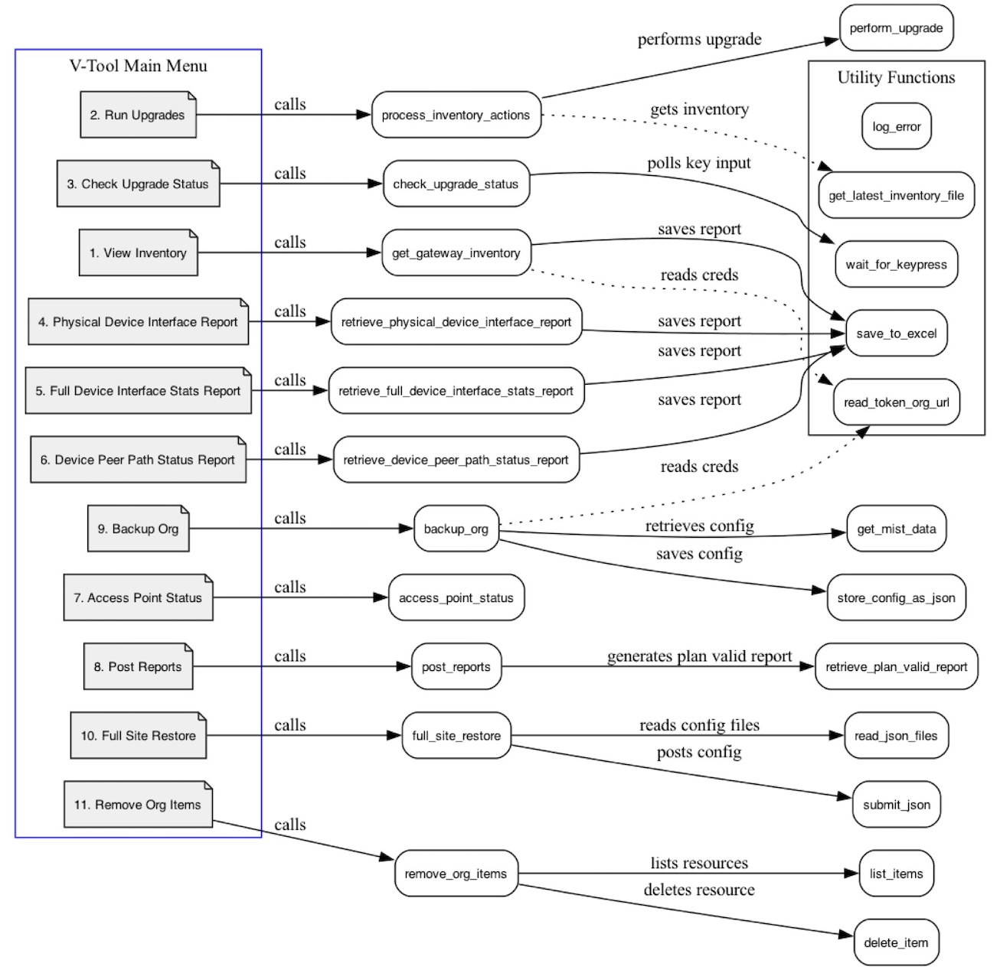
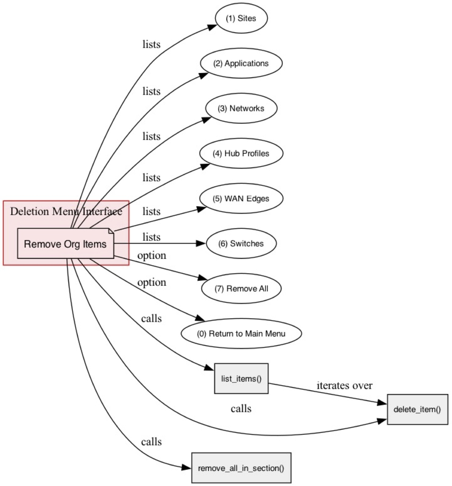
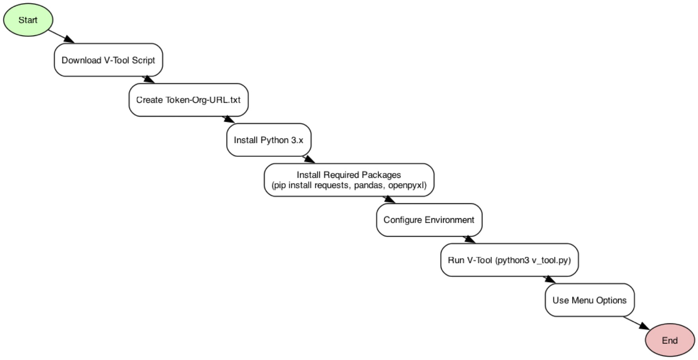
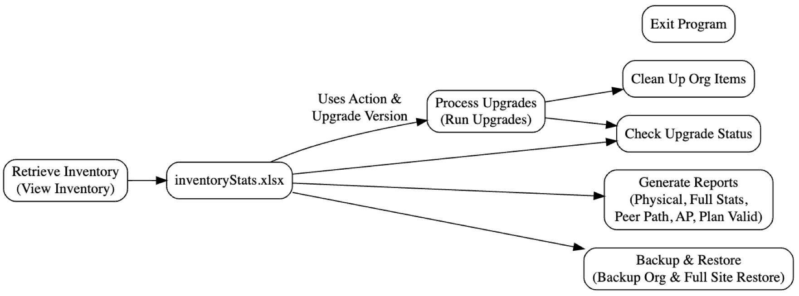
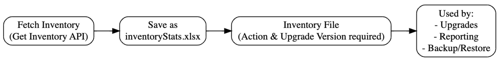
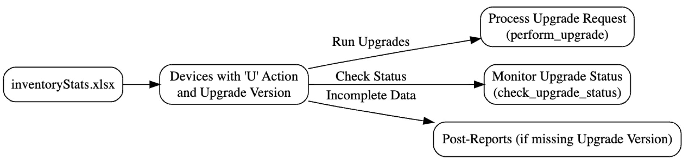
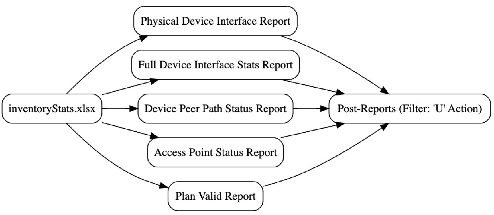
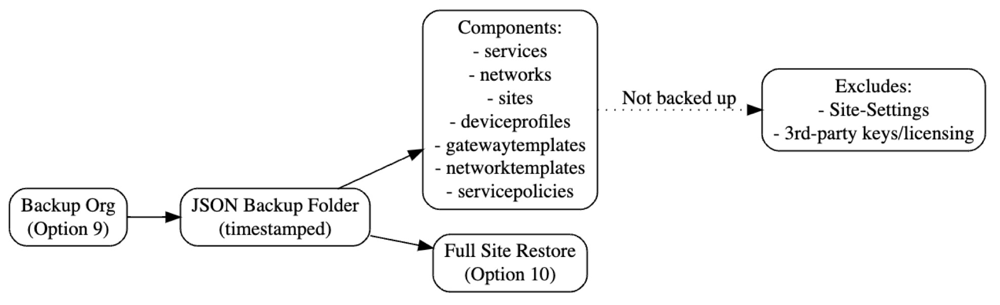
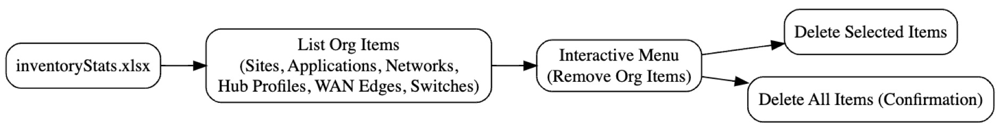
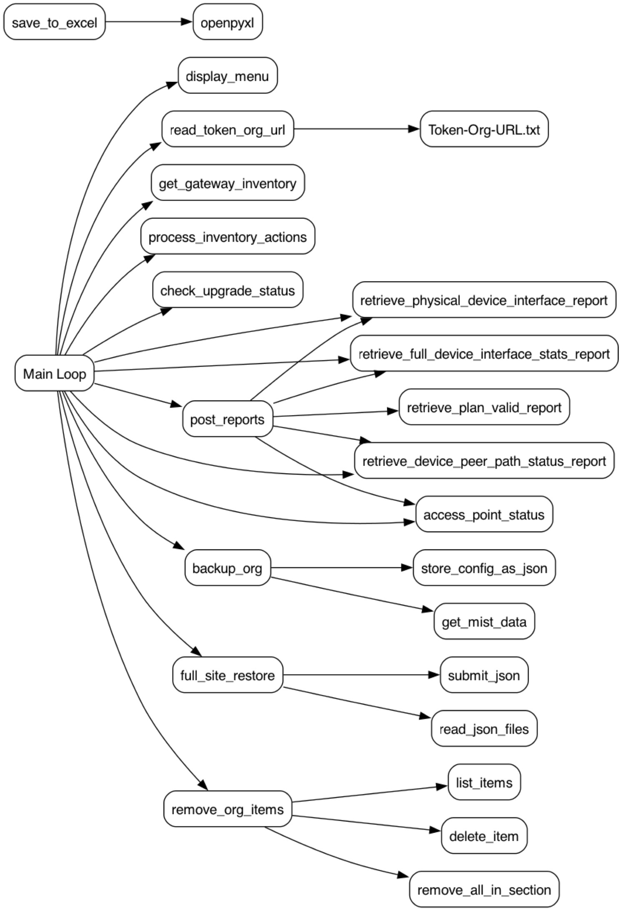

# Mist V-Tool Guide

**Purpose:**

This tool is an experimental utility designed for testing and educational purposes only. It should not be used in production environments.

Built to demonstrate the capabilities of modern MIST APIs, this tool streamlines network device management and upgrade workflows by consolidating key functions such as inventory retrieval, device upgrade initiation, live status monitoring, and comprehensive report generation. By automating these tasks, it reduces manual configuration efforts and provides a structured way for users to explore API-driven network operations.

The primary goal is to help network engineers and developers learn API methodologies, experiment with automation techniques, and build their own scalable solutions. While this tool showcases effective network automation strategies, users should review and modify any automation logic before applying similar techniques in production environments.

---
**Table of Contents**

[1. Introduction](#1-introduction)

[2. Disclaimer & Liability](#2-disclaimer--liability)

[3. Prerequisites](#3-prerequisites)

[4. Environment Setup](#4-environment-setup)

[5. Overview of the V-Tool Code](#5-overview-of-the-v-tool-code)

[5.1 General Structure](#51-general-structure)

[5.2 Functions and Their Purposes](#52-functions-and-their-purposes)

[6. Detailed Walkthrough of Menu Items](#6-detailed-walkthrough-of-menu-items)

[6.1 Menu Item 1: View Inventory](#61-menu-item-1-view-inventory)

[6.2 Menu Item 2: Run Upgrades](#62-menu-item-2-run-upgrades)

[6.3 Menu Item 3: Check Upgrade Status](#63-menu-item-3-check-upgrade-status)

[6.4 Menu Item 4: Physical Device Interface Report](#64-menu-item-4-physical-device-interface-report)

[6.5 Menu Item 5: Full Device Interface Stats Report](#65-menu-item-5-full-device-interface-stats-report)

[6.6 Menu Item 6: Device Peer Path Status Report](#66-menu-item-6-device-peer-path-status-report)

[6.7 Menu Item 7: Access Point Status](#67-menu-item-7-access-point-status)

[6.8 Menu Item 8: Post Reports](#68-menu-item-8-post-reports)

[6.9 Menu Item 9: Backup Org](#69-menu-item-9-backup-org)

[6.10 Menu Item 10: Full Site Restore](#610-menu-item-10-full-site-restore)

[6.11 Menu Item 11: Remove Org Items](#611-menu-item-11-remove-org-items)

[7. How to Run the Code](#7-how-to-run-the-code)

[8. Flow Diagrams](#8-flow-diagrams)

[9. Conclusion & Next Steps](#9-conclusion--next-steps)

[10. Comprehensive Script Overview](#10-comprehensive-script-overview)

[11. Detailed Section Descriptions](#11-detailed-section-descriptions)

[11.1. Inventory Retrieval](#111-inventory-retrieval)

[11.2. Upgrade Operations](#112-upgrade-operations)

[11.3. Reporting Functions](#113-reporting-functions)

[11.4. Backup and Restore Configurations](#114-backup-and-restore-configurations)

[11.5. Clean Up Organizational Items](#115-clean-up-organizational-items)

[11.6. Exit](#116-exit)

[12. Important Operational Notes](#12-important-operational-notes)

[13. Summary and Disclaimer](#13-summary-and-disclaimer)

[14. Debug, Logging, and Report Functionality](#14-debug-logging-and-report-functionality)

[14.1 Debug and Log File Functionality](#debug-and-log-file-functionality)

[14.2 Dbug.xlsx - API Request Logging](#dbugxlsx---api-request-logging)

[14.3 Log.xlsx - Error Logging](#logxlsx---error-logging)

[14.4 Excel Reports Generated by the Tool](#excel-reports-generated-by-the-tool)

[14.5 Inventory Report](#inventory-report-inventorystatsxlsx)

[14.6 Post-Upgrade Report](#post-upgrade-report-post-inventorystatsxlsx)

[14.7 Access Point Status Report](#access-point-status-report-accesspointstatsxlsx)

[14.8 Physical Device Interface Report](#physical-device-interface-report-physicaldeviceinterfacereportxlsx)

[14.9 VPN Peers Report](#vpn-peers-report-devicepeerpathreportxlsx)

[15. POST- Reports Documentation](#15-post--reports-documentation)

[15.1. Post-Physical Device Interface Report](#1-post-physical-device-interface-report)

[15.2. Post-Full Device Interface Stats Report](#2-post-full-device-interface-stats-report)

[15.3. Post-Device Peer Path Status Report](#3-post-device-peer-path-status-report)

[15.4. Post-Access Point Status Report](#4-post-access-point-status-report)

[15.5. Post-Plan Valid Report](#5-post-plan-valid-report)

## 1. Introduction

This guide explains the V-Tool, a Python-based upgrade and management tool for Mist API environments. The tool offers functions such as inventory viewing, upgrade processing, live status checking, report generation, backup operations, full site restoration, and resource deletion. This document is intended for development and testing purposes only.

## 2. Disclaimer & Liability

Disclaimer: The code provided in this guide is distributed 'as is' without any warranties, expressed or implied. It is intended solely for testing and development purposes and must not be used in production. The author, Steve Voto, assumes no liability for any damages resulting from the use of this tool.

## 3. Prerequisites

Before setting up the V-Tool, ensure you have the following:

3.1 Python Installation (Windows):
 - Download Python 3.x from python.org and install it. Ensure 'Add Python to PATH' is selected.

3.2 Python Installation (Linux):
 - Install Python 3.x using your distribution’s package manager (e.g., sudo apt-get install python3 python3-pip).

3.3 Required Python Packages:
 - Install necessary packages using pip:  `pip install requests pandas openpyxl` 

## 4. Environment Setup

1. Download the V-Tool script and save it in a working directory.
2. Create a file named Token-Org-URL.txt in the same directory with the following content:  
 token=<your\_api\_token>  
 org\_id=<your\_org\_id>  
 base\_url=https://api.mist.com/api/v1  
3. Open a terminal, navigate to the directory, and run the script using: python3 v\_tool.py

## 5. Overview of the V-Tool Code

The V-Tool is organized into several sections: logging, menu display, API credential reading, report generation, inventory and upgrade functions, backup/restore functions, deletion functions, and the main loop. Each function is designed to handle a specific task. The code is structured to be modular and easy to update.

### 5.1 General Structure

- Logging functions to record errors and events in rotating Excel log files.
- Functions to display the ASCII word art menu.
- Functions to read API credentials from a file.
- Report generation functions for various data points.
- Functions to process inventory and upgrades.
- Backup and restore functions for configurations.
- Deletion functions (Remove Org Items) for resource management.
- A main loop that displays the menu and routes user input accordingly.

### 5.2 Functions and Their Purposes

- log\_error(message): Logs errors and events with timestamps to a rotating Excel log file.
- save\_to\_excel(data, filename): Saves data to Excel with a hunter green header and autosized columns.
- read\_token\_org\_url(file\_path): Reads API credentials from Token-Org-URL.txt.
- get\_latest\_inventory\_file(): Locates the most recent inventory file.
- get\_gateway\_inventory(org\_id, token, base\_url): Retrieves gateway inventory from Mist API.
- process\_inventory\_actions(filename, token, base\_url): Processes devices marked for upgrade.
- check\_upgrade\_status(filename, token, base\_url): Monitors live upgrade status.
- Various report functions to retrieve and save reports in Excel format.
- backup\_org(token, org\_id, base\_url): Backs up configurations to JSON files.
- full\_site\_restore(token, org\_id, base\_url): Restores configurations from backup.
- Deletion functions (list\_items, delete\_item, remove\_org\_items) for managing resources.
- post\_reports(token, org\_id, base\_url): Generates reports for devices marked for upgrade.
- The main() function that ties everything together.

## 6. Detailed Walkthrough of Menu Items

#### 6.1 Menu Item 1: View Inventory

Function: get\_gateway\_inventory(org\_id, token, base\_url)  
Purpose: Retrieves gateway inventory from the Mist API and saves it as 'inventoryStats.xlsx'.  
Usage: Select option 1 from the main menu.

#### 6.2 Menu Item 2: Run Upgrades

Function: process\_inventory\_actions(filename, token, base\_url)  
Purpose: Reads the latest inventory file, identifies devices marked for upgrade ('U'), and sends upgrade requests.  
Usage: Select option 2 from the main menu.

#### 6.3 Menu Item 3: Check Upgrade Status

Function: check\_upgrade\_status(filename, token, base\_url)  
Purpose: Monitors live upgrade status and displays progress with color-coded output.  
Usage: Select option 3; press 'X' to exit back to the menu.

#### 6.4 Menu Item 4: Physical Device Interface Report

Function: retrieve\_physical\_device\_interface\_report(token, org\_id, base\_url)  
Purpose: Retrieves current status of physical interfaces and saves an Excel report.  
Usage: Select option 4.

#### 6.5 Menu Item 5: Full Device Interface Stats Report

Function: retrieve\_full\_device\_interface\_stats\_report(token, org\_id, base\_url)  
Purpose: Gathers detailed interface statistics and saves a report in Excel.  
Usage: Select option 5.

#### 6.6 Menu Item 6: Device Peer Path Status Report

Function: retrieve\_device\_peer\_path\_status\_report(token, org\_id, base\_url)  
Purpose: Retrieves VPN peer path statistics and saves a corresponding report.  
Usage: Select option 6.

#### 6.7 Menu Item 7: Access Point Status

Function: access\_point\_status(token, org\_id, base\_url)  
Purpose: Retrieves access point statistics, merges router names, and outputs a formatted report.  
Usage: Select option 7.

#### 6.8 Menu Item 8: Post Reports

Function: post\_reports(token, org\_id, base\_url)  
Purpose: Filters the inventory for devices marked 'U' and generates all reports with 'Post-' prefixes.  
Usage: Select option 8.

#### 6.9 Menu Item 9: Backup Org

Function: backup\_org(token, org\_id, base\_url)  
Purpose: Retrieves configuration data from the Mist API and saves each item as a JSON file in a timestamped folder.  
Usage: Select option 9.

#### 6.10 Menu Item 10: Full Site Restore

Function: full\_site\_restore(token, org\_id, base\_url)  
Purpose: Prompts the user to select a backup folder and posts JSON configuration files back to the Mist API.  
Usage: Select option 10.

#### 6.11 Menu Item 11: Remove Org Items

Function: remove\_org\_items(token, org\_id, base\_url)  
Purpose: Provides an interactive menu to list and delete Mist API resources (Sites, Applications, Networks, Hub Profiles, WAN Edges, and Switches).  
Usage: Select option 11. All deletion operations are logged with successes and failures.

## 7. How to Run the Code

1. Open a terminal/command prompt and navigate to the directory where the V-Tool script is saved.
2. Ensure Python 3 and the required packages (requests, pandas, openpyxl) are installed.
3. Update the Token-Org-URL.txt file with your API token, org\_id, and base\_url.
4. Run the script using: python3 v\_tool.py
5. Follow the on-screen menu prompts to use the various functions.

## 8. Flow Diagrams

- Figure 1: V-Tool Main Menu Screenshot

- Figure 2: Deletion Menu Interface

- Figure 3: Environment Setup Flowchart

## 9. Conclusion & Next Steps

This guide has provided a detailed walkthrough of the V-Tool, including environment setup, function overview, and step-by-step usage instructions. Remember, this tool is for testing and development only and should not be used in production. Always ensure you have proper backups and credentials before running deletion operations. Review the log files regularly for any errors or unexpected behavior. For further modifications, consult the development team or additional Mist API documentation.

## 10. Comprehensive Script Overview

This advanced script is designed to manage gateway upgrades and execute various network operations via the Mist API. It offers a **menu-driven interface** that guides the user through several critical tasks:

* **Retrieve Inventory:**  
  Fetch the current gateway inventory and save it to an Excel file (prefixed with inventoryStats.xlsx).
  ***Note:*** This file must include two key columns:
  + **Action Column:** Devices marked with **“U”** indicate they are scheduled for upgrade.
  + **Upgrade Version Column:** Specifies the target version for migration.
* **Process Upgrades:**  
  Initiate upgrade requests for devices based on the inventory data. Only devices with an action marked **“U”** and a specified upgrade version are processed. Devices marked for upgrade without an upgrade version will be highlighted in the **Post‑Reports** for further review and monitoring.
* **Generate Reports:**  
  Produce several detailed Excel reports, including:
  + **Physical Device Interface Report**
  + **Full Device Interface Statistics Report**
  + **Device Peer Path Status Report**
  + **Access Point Status Report**
  + **Plan Valid Report**
    The **Post‑Reports** variant outputs only data for devices marked for upgrade, allowing focused monitoring.
* **Backup and Restore Configurations:**  
  **Backup:**  
  Selectively backs up configuration components by saving each as a JSON file in a timestamped folder.  
  **Backed-up Components Include:**  
  + Application Configurations (services)
  + Network Configurations (networks)
  + Site Configurations (sites)
  + Device Profiles (gateways)
  + Gateway Templates (WAN configurations)
  + Network Templates (switch configurations)
  + Service Policies (servicepolicies)

**Exclusions:**
Site‑Setting data, third‑party keys, and licensing information are not backed up. This mechanism is primarily intended to handle the heavy lifting of SSR configurations and enable rapid redeployment across organizations.

**Restore:**
Enables you to select a backup folder and reapply the backed‑up configurations to the Mist API, updating organization IDs and site mappings as needed.

* **Clean Up Organizational Items:**  
  Provides an interactive tool to list and delete various organizational resources (Sites, Applications, Networks, Hub Profiles, WAN Edges, and Switches).
* **Exit:**  
  Gracefully terminates the program.

**Figure 1: Overall Flow Diagram**

High‑level diagram of the script’s workflow:

## 11. Detailed Section Descriptions

#### 11.1. Inventory Retrieval

**Purpose:**  
Fetch current gateway inventory data from the Mist API and save it as inventoryStats.xlsx.

**Key Requirement:**  
The inventory file must include two essential columns:

* **Action:** Devices marked with **“U”** are selected for upgrade.
* **Upgrade Version:** Specifies the target version for migration.

**Usage:**  
* **Option 1 ("View Inventory")** must be run first. This file is critical as all subsequent operations depend on its data.

**Figure 2: Inventory Retrieval Flow**

#### 11.2. Upgrade Operations

**Purpose:**  
Trigger upgrade requests for devices based on the inventory data.

**Important Note:**  
* **Action Column:** Must be set to **“U”** for devices to be upgraded.
* **Upgrade Version Column:** Must contain the target version.
  Devices with “U” but lacking a defined upgrade version will be highlighted in the **Post‑Reports** (Option 8) and monitored in **Option 3 (Check Upgrade Status)**.

**Usage:**  
* **Option 2 ("Run Upgrades")** processes upgrade requests for devices with complete data.
* **Option 3 ("Check Upgrade Status")** monitors the upgrade progress for these devices.

**Figure 3: Upgrade Operations Flow**

#### 11.3. Reporting Functions

**Purpose:**  
Generate several detailed Excel reports to analyze device interfaces, statistics, and status.

**Reports Include:**  
* **Physical Device Interface Report**
* **Full Device Interface Statistics Report**
* **Device Peer Path Status Report**
* **Access Point Status Report**
* **Plan Valid Report**

**Usage:**  
* All reports use data from inventoryStats.xlsx.
* The **Post‑Reports** variant outputs only devices marked for upgrade (with the "U" action), allowing you to concentrate on upgrade candidates.

**Figure 4: Reporting Functions Flow**

#### 11.4. Backup and Restore Configurations

**Purpose:**  
Enable rapid deployment of similar SSR configurations by backing up and restoring key configuration components.

**Backup:**  
Only the following components are backed up:

* **Application Configurations** (services)
* **Network Configurations** (networks)
* **Site Configurations** (sites)
* **Device Profiles (Gateways)** (deviceprofiles)
* **Gateway Templates** (WAN configurations)
* **Network Templates** (switch configurations)
* **Service Policies** (servicepolicies)

**Exclusions:**  
* **Site‑Setting data is not backed up**
* **Third‑party keys/licensing information are excluded**

**Usage:**  
* **Option 9 ("Backup Org")** retrieves and stores the configuration data as JSON files in a timestamped backup folder.
* **Option 10 ("Full Site Restore")** allows you to select a backup folder and reapply these configurations to the Mist API, updating organization IDs and site mappings as needed.

**Figure 5: Backup and Restore Flow**

#### 11.5. Clean Up Organizational Items

**Purpose:**  
Provide an interactive tool for listing and deleting various organizational items from the Mist API, such as:

* Sites
* Applications
* Networks
* Hub Profiles
* WAN Edges
* Switches

**Usage:**  
* **Option 11 ("Remove Org Items")** displays a menu for selecting specific sections to delete or for removing all items across sections.

**Figure 6: Organizational Cleanup Flow**

#### 11.6. Exit

**Purpose:**  
Gracefully terminate the program.

**Usage:**  
* **Option 0 ("Exit")** ends the script’s execution.

**Figure 7: Exit Flow**

## 12. Important Operational Notes

* **Inventory File Requirement:**  
  Always run **Option 1 ("View Inventory")** first to create the inventoryStats.xlsx file. This file is the cornerstone for all subsequent operations (upgrades, reports, backup/restore).
* **Upgrade-Specific Columns:**  
  When running **Option 2 ("Run Upgrades")**:
  + The **Action Column** must be set to **“U”** to designate devices for upgrade.
  + The **Upgrade Version Column** must contain the new target version.
    If a device is marked with “U” but lacks an upgrade version, it will be included in the **Post‑Reports (Option 8)**, enabling you to review which devices require additional attention, and its status will be monitored via **Option 3 ("Check Upgrade Status")**.
* **Backup and Restore Limitations:**  
  Only the specified components (services, networks, sites, deviceprofiles, gatewaytemplates, networktemplates, servicepolicies) are backed up.
  **Note:**
  + **Site‑Setting data is not backed up**.
  + **Third‑party keys and licensing information are not included.**  
    This selective backup is designed to handle the heavy lifting of SSR configurations and enable rapid redeployment of similar setups across organizations.
* **Disclaimer:**  
  This tool is intended for experimental and testing purposes only and is **not** recommended for use in production environments. Ensure that you have the proper authorizations and prerequisites before executing any operations.

## 13. Summary and Disclaimer

This script offers a comprehensive suite of network management tools—from inventory retrieval and upgrade processing to detailed reporting, selective backup/restore, and organizational cleanup. The proper sequence of operations is critical:

1. **Inventory Retrieval (Option 1):** Creates the essential inventoryStats.xlsx file.
2. **Upgrade Operations (Options 2 & 3):** Process devices marked for upgrade and monitor their progress.
3. **Reporting (Options 4–8):** Generate targeted reports, with Post‑Reports focusing on devices marked with “U” for upgrade.
4. **Backup and Restore (Options 9 & 10):** Back up key configuration components and restore them as needed.
5. **Organizational Cleanup (Option 11):** Interactively manage and delete organization items.
6. **Exit (Option 0):** Safely terminate the program.

**Disclaimer:**  
This tool is intended solely for experimental and testing purposes. It is not recommended for deployment in production environments. Use with caution and only with proper authorizations.

**Summary of API Calls**

| **Method** | **API Purpose** | **Function Name** |
| --- | --- | --- |
| **GET** | Fetch Gateway Inventory | get\_gateway\_inventory() |
| **GET** | Check Upgrade Status | check\_upgrade\_status() |
| **GET** | Fetch Access Point Status | access\_point\_status() |
| **GET** | Fetch Items for Deletion | list\_items() |
| **GET** | Fetch Physical Device Interface Report | retrieve\_physical\_device\_interface\_report() |
| **GET** | Fetch Full Device Interface Stats Report | retrieve\_full\_device\_interface\_stats\_report() |
| **GET** | Fetch VPN Peers Report | retrieve\_vpn\_peers\_report() |
| **POST** | Send Upgrade Request for a Device | perform\_upgrade() |
| **POST** | Create New Sites During Full Site Restore | full\_site\_restore() |
| **POST** | Submit JSON Data for Restore Operations | submit\_json() |
| **PUT** | Update Site Settings During Full Site Restore | full\_site\_restore() |
| **PUT** | Update Service Policies During Full Site Restore | full\_site\_restore() |

**Error Handling**

## 14. Debug, Logging, and Report Functionality

### Debug and Log File Functionality

This tool logs API interactions, errors, and debugging details into two structured Excel files: 'dbug.xlsx' and 'log.xlsx'. These files provide insights into tool execution and facilitate troubleshooting.

#### Dbug.xlsx - API Request Logging

The 'dbug.xlsx' file records all API interactions. It captures API method calls, payloads, and responses to help users understand API behavior and detect issues.

\*\*Columns in dbug.xlsx:\*\*

* 1. \*\*TIME\*\* – Timestamp of the API request.
* 2. \*\*FUNCTION CALLED\*\* – Name of the function initiating the request.
* 3. \*\*METHOD\*\* – HTTP method used (GET, POST, PUT, DELETE).
* 4. \*\*API USED\*\* – API endpoint accessed.
* 5. \*\*PAYLOAD INFORMATION\*\* – JSON payload sent with the request.
* 6. \*\*DESCRIPTION OR ERROR INFO\*\* – Response details including errors.

#### Log.xlsx - Error Logging

The 'log.xlsx' file captures errors and significant events encountered during execution. It ensures that critical failures and warnings are recorded for debugging.

\*\*Columns in log.xlsx:\*\*

* 1. \*\*Timestamp\*\* – Date and time of the event.
* 2. \*\*Error Message\*\* – Description of the error.
* 3. \*\*Details\*\* – Additional information about the issue.

### Excel Reports Generated by the Tool

The tool generates structured Excel reports to aid in network upgrade tracking, inventory management, and post-upgrade validation.

#### Inventory Report (inventoryStats.xlsx)

This report contains detailed information about network devices retrieved from the Mist API. It includes device names, MAC addresses, firmware versions, and upgrade statuses.

\*\*Key Fields:\*\*

- Device Name
- MAC Address
- Site ID
- Firmware Version
- Upgrade Status

#### Post-Upgrade Report (Post-InventoryStats.xlsx)

A filtered version of the inventory report, containing only devices marked for upgrade ('U'). It tracks upgrade status and progress.

#### Access Point Status Report (AccessPointStats.xlsx)

This report provides real-time access point status for different sites. It merges inventory data to display site-wise router and AP relationships.

\*\*Key Fields:\*\*

- Router Name
- Device ID
- Site ID
- AP Status

#### Physical Device Interface Report (PhysicalDeviceInterfaceReport.xlsx)

This report captures device interface details, including network interfaces, connectivity status, and assigned VLANs.

\*\*Key Fields:\*\*

- Device Name
- Interface Name
- VLAN ID
- Status (Up/Down)

#### VPN Peers Report (DevicePeerPathReport.xlsx)

This report lists VPN peer connections, including peer router names, latency, and uptime statistics.

\*\*Key Fields:\*\*

- Router Name
- Peer Router Name
- Latency
- Connection Status

## 15. POST- Reports Documentation

The POST- reports are generated after an upgrade process to verify the status and performance of devices marked for upgrade (Action = 'U'). These reports focus on post-upgrade validation and network stability assessment.

#### 1. Post-Physical Device Interface Report

This report retrieves physical interface details for upgraded devices. It includes details such as interface status, network association, and operational state after the upgrade.

#### 2. Post-Full Device Interface Stats Report

This report provides a full set of interface statistics for upgraded devices, including port utilization, traffic metrics, and connectivity status. It helps in identifying performance degradation or improvements post-upgrade.

#### 3. Post-Device Peer Path Status Report

This report captures the status of device peer paths after an upgrade. It includes latency, jitter, and connection stability details to assess the impact of upgrades on peer-to-peer communication.

#### 4. Post-Access Point Status Report

This report provides an overview of access points associated with upgraded devices. It ensures that access points remain operational and correctly mapped to the upgraded network infrastructure.

#### 5. Post-Plan Valid Report

This report verifies if the network and device configurations remain valid after the upgrade. It cross-checks expected configurations with actual post-upgrade settings and highlights inconsistencies.
